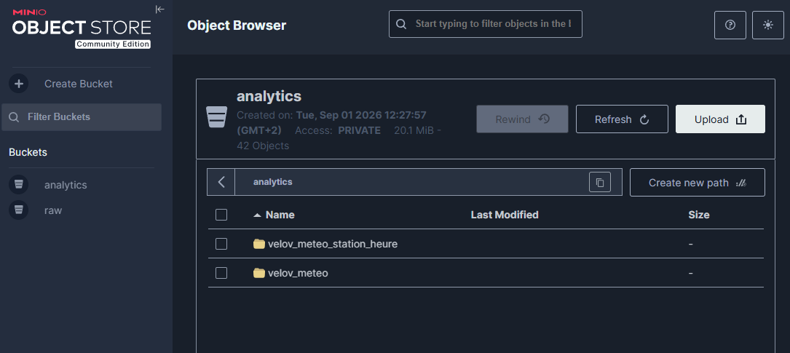
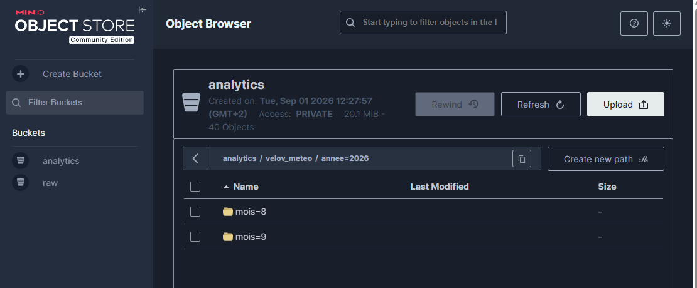
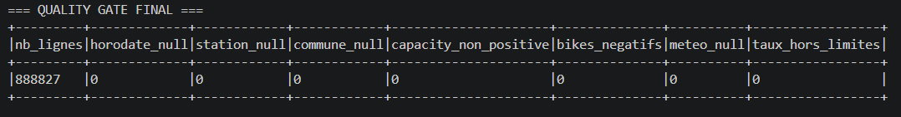

# Data Lake PySpark — Vélo'v & Météo

## Présentation

Ce projet met en place un **Data Lake local conteneurisé** permettant de collecter et de croiser des données de mobilité Vélo'v avec des données météorologiques.

Technologies utilisées :

- **MongoDB** : zone Landing ;
- **MinIO / S3** : zones Raw et Analytics ;
- **Apache Spark** : traitements distribués ;
- **Python** : ingestion des APIs ;
- **Docker Compose** : orchestration des services.

Le pipeline collecte les stations et les disponibilités Vélo'v ainsi que les données météo.

Spark nettoie ensuite les données, effectue les jointures, contrôle leur qualité et écrit les résultats au format **Parquet partitionné** dans MinIO.

---

## Architecture

```text
             APIs Vélo'v / Open-Meteo
                       │
                       ▼
                  Extraction Python
                       │
             ┌─────────┴─────────┐
             ▼                   ▼
      MongoDB Landing        MinIO Raw
      - disponibilités       - stations
      - météo                - météo CSV
             │                   │
             └─────────┬─────────┘
                       ▼
                 Cluster Spark
               Master + Worker
                       │
          nettoyage / jointures
          qualité / agrégations
                       │
                       ▼
                MinIO Analytics
              Parquet annee/mois
```

---

## Structure du projet

```text
velov-weather-pipeline/
├── .env
├── .env.example
├── .gitignore
├── pyproject.toml
├── README.md
├── requirements.txt
│
├── docker/
│   ├── docker-compose.yml
│   ├── Dockerfile
│   └── log4j2.properties
│
├── docs/
│   └── images/
│       ├── minio-analytics.png
│       ├── minio-partitions.png
│       ├── quality-gate.png
│       └── spark-ui.png
│
├── src/
│   ├── config/
│   │   ├── __init__.py
│   │   └── settings.py
│   │
│   ├── extraction/
│   │   ├── __init__.py
│   │   ├── collect_meteo.py
│   │   ├── collect_velov.py
│   │   ├── load_meteo_minio.py
│   │   ├── load_mongo.py
│   │   ├── load_velov_minio.py
│   │   └── main.py
│   │
│   ├── jobs/
│   │   ├── __init__.py
│   │   └── main.py
│   │
│   └── utils/
│       ├── __init__.py
│       └── spark_session.py
│
└── tests/
    ├── test_mongodb.py
    └── test_velov_raw.py
```

---

## Prérequis

- Docker
- Docker Compose
- Git

Aucune installation locale de Spark, MongoDB ou MinIO n'est nécessaire.

---

## Configuration

Créer un fichier `.env` à la racine du projet en utilisant `.env.example` comme modèle.

Exemple :

```env
# MongoDB
MONGO_INITDB_ROOT_USERNAME=change_me
MONGO_INITDB_ROOT_PASSWORD=change_me
MONGO_DATABASE=velov_weather
MONGO_PORT=27017
MONGO_HOST=mongodb

# MinIO
MINIO_ROOT_USER=change_me
MINIO_ROOT_PASSWORD=change_me
MINIO_PORT=9000
MINIO_CONSOLE_PORT=9001
MINIO_ENDPOINT=http://minio:9000
MINIO_RAW_BUCKET=raw
MINIO_ANALYTICS_BUCKET=analytics

# Spark
SPARK_MASTER_PORT=7077
SPARK_MASTER_WEBUI_PORT=8080

# APIs
VELOV_STATIONS_URL=https://data.grandlyon.com/fr/datapusher/ws/grandlyon/pvo_patrimoine_voirie.pvostationvelov/all.json
VELOV_AVAILABILITIES_URL=https://data.grandlyon.com/fr/datapusher/ws/timeseries/jcd_jcdecaux.historiquevelov/all.json
OPEN_METEO_URL=https://historical-forecast-api.open-meteo.com/v1/forecast

# Temps
TIMEZONE=Europe/Paris
```

Le fichier `.env` contient les valeurs locales et les secrets et n'est pas versionné.

Le fichier `.env.example` est versionné afin de documenter les variables nécessaires sans exposer les identifiants réels.

Les paramètres utilisés par le code Python sont centralisés dans :

```text
src/config/settings.py
```

---

## Démarrage

Toutes les commandes Docker Compose sont exécutées depuis la racine du projet.

### Démarrer l'infrastructure

```powershell
docker compose -f docker/docker-compose.yml --env-file .env up -d --build
```

Cette commande permet notamment de démarrer :

```text
MongoDB
MinIO
MinIO Init
Spark Master
Spark Worker
Extraction Python
```

Vérifier l'état des services :

```powershell
docker compose -f docker/docker-compose.yml --env-file .env ps
```

Interfaces disponibles :

```text
MinIO Console : http://localhost:9001
Spark Master  : http://localhost:8080
Spark Worker  : http://localhost:8081
```

---

## Initialisation automatique de MinIO

Le service Docker Compose :

```text
minio-init
```

attend que MinIO soit disponible puis crée automatiquement les buckets :

```text
raw
analytics
```

Le bucket `raw` reçoit les données brutes.

Le bucket `analytics` reçoit les fichiers Parquet produits par Spark.

Il n'est donc pas nécessaire de créer manuellement les buckets après un démarrage à froid.

---

## Extraction et backfill

Le service `extraction` collecte :

- le référentiel des stations Vélo'v ;
- les disponibilités Vélo'v ;
- les données météo des communes concernées.

Exemple de collecte sur une période définie :

```powershell
docker compose -f docker/docker-compose.yml --env-file .env run --rm `
  -e EXTRACTION_START_DATE=2026-08-27 `
  -e EXTRACTION_END_DATE=2026-09-02 `
  extraction
```

Sans dates fournies, le pipeline reprend à partir de la dernière date présente dans MongoDB ou utilise la période prévue par le script lorsque la base est vide.

Les données sont réparties entre MongoDB et MinIO.

### MongoDB Landing

```text
MongoDB / velov_weather
├── velov_stations
├── velov_availabilities
└── lyon_meteo
```

### MinIO Raw

```text
raw/
├── velov/stations/
└── meteo/
```

Les insertions MongoDB utilisent des **upserts** afin d'éviter les doublons lors d'une nouvelle collecte.

---

## Traitement PySpark

Le job principal se trouve dans :

```text
src/jobs/main.py
```

La création et la configuration de la SparkSession sont centralisées dans :

```text
src/utils/spark_session.py
```

Le job lit :

- le référentiel des stations depuis **MinIO Raw** ;
- les disponibilités Vélo'v depuis **MongoDB** ;
- les données météo depuis **MongoDB**.

Le traitement effectue notamment :

- le typage des dates ;
- la suppression des doublons ;
- la jointure disponibilités / stations ;
- le contrôle des stations orphelines ;
- l'alignement temporel sur des créneaux de 15 minutes ;
- la jointure Vélo'v / météo ;
- le contrôle de cohérence capacité / vélos ;
- le calcul du taux de vélos disponibles ;
- la création des variables temporelles ;
- les contrôles qualité ;
- l'agrégation station / heure ;
- l'écriture des résultats au format Parquet partitionné.

### Exécution du job Spark

```powershell
docker exec datalake-spark-master /opt/spark/bin/spark-submit `
  --conf spark.jars.ivy=/tmp/.ivy2 `
  --packages org.apache.hadoop:hadoop-aws:3.4.2,org.mongodb.spark:mongo-spark-connector_2.13:11.1.0 `
  --master spark://spark-master:7077 `
  /opt/spark/src/jobs/main.py
```

---

## Quality Gate

Avant publication dans la zone Analytics, Spark contrôle notamment :

```text
horodate manquant
station manquante
commune manquante
capacité <= 0
nombre de vélos négatif
météo manquante
taux de disponibilité hors 0–100 %
```

Sur le backfill principal utilisé pour valider le projet :

```text
Lignes MongoDB                  : 890 120
Lignes exploitables             : 888 838
Lignes orphelines               : 1 282
Anomalies capacité / vélos      : 11
Lignes sans météo               : 0
Lignes Analytics finales        : 888 827
Agrégations station / heure     : 56 342
```

Quality Gate final :

```text
horodate_null           = 0
station_null            = 0
commune_null            = 0
capacity_non_positive   = 0
bikes_negatifs          = 0
meteo_null              = 0
taux_hors_limites       = 0
```

Après la réorganisation du projet, un nouveau test complet du job Spark a également été réalisé sur un jeu de données partiel :

```text
Disponibilités MongoDB          : 160 000
Lignes exploitables             : 156 069
Lignes orphelines               : 3 931
Lignes sans météo               : 0
Anomalies capacité / vélos      : 0
Lignes Analytics                : 156 069
Agrégations station / heure     : 16 548
```

Le Quality Gate de ce test est également entièrement à zéro.

---

## Sorties Analytics

Les résultats sont écrits dans MinIO :

```text
analytics/
├── velov_meteo/
└── velov_meteo_station_heure/
```

Les fichiers sont au format **Parquet** et partitionnés par :

```text
annee
mois
```

Exemple :

```text
analytics/velov_meteo/
└── annee=2026/
    ├── mois=8/
    └── mois=9/
```

Le partitionnement permet de limiter les données à parcourir lorsqu'un traitement porte seulement sur une période donnée.

---

## Tests techniques

Deux tests permettent de vérifier les connecteurs Spark.

```text
tests/
├── test_mongodb.py
└── test_velov_raw.py
```

### Test MongoDB

```powershell
docker exec datalake-spark-master /opt/spark/bin/spark-submit `
  --conf spark.jars.ivy=/tmp/.ivy2 `
  --packages org.apache.hadoop:hadoop-aws:3.4.2,org.mongodb.spark:mongo-spark-connector_2.13:11.1.0 `
  --master spark://spark-master:7077 `
  /opt/spark/tests/test_mongodb.py
```

Résultat validé :

```text
NB STATIONS = 457
```

### Test MinIO Raw

```powershell
docker exec datalake-spark-master /opt/spark/bin/spark-submit `
  --conf spark.jars.ivy=/tmp/.ivy2 `
  --packages org.apache.hadoop:hadoop-aws:3.4.2,org.mongodb.spark:mongo-spark-connector_2.13:11.1.0 `
  --master spark://spark-master:7077 `
  /opt/spark/tests/test_velov_raw.py
```

Résultat validé :

```text
NB STATIONS = 457
```

---

## Qualité du code

Le projet utilise **Ruff 0.12.12** pour le formatage et le contrôle du code Python.

### Formatage

```powershell
docker run --rm `
  -v "${PWD}:/workspace" `
  -w /workspace `
  data-lake-pyspark-extraction `
  python -m ruff format src tests
```

### Vérification

```powershell
docker run --rm `
  -v "${PWD}:/workspace" `
  -w /workspace `
  data-lake-pyspark-extraction `
  python -m ruff check src tests
```

Résultat obtenu :

```text
All checks passed!
```

Validation du fichier Docker Compose :

```powershell
docker compose -f docker/docker-compose.yml --env-file .env config --quiet
```

Une absence de sortie signifie que la configuration est valide.

---

## Persistance

MongoDB et MinIO utilisent des volumes Docker :

```text
mongo_data
minio_data
```

Pour arrêter les services sans supprimer les données :

```powershell
docker compose -f docker/docker-compose.yml --env-file .env down
```

Les volumes sont conservés.

Pour supprimer également les volumes :

```powershell
docker compose -f docker/docker-compose.yml --env-file .env down -v
```

Attention : cette commande supprime les données MongoDB et les données MinIO.

Au prochain démarrage, le service `minio-init` recrée automatiquement les buckets `raw` et `analytics`.

---

## Validation du démarrage à froid

Le projet a été testé après suppression des volumes avec :

```powershell
docker compose -f docker/docker-compose.yml --env-file .env down -v
docker compose -f docker/docker-compose.yml --env-file .env up -d --build
```

Les points suivants ont été validés :

```text
MongoDB démarre                 OK
MinIO démarre                  OK
Spark Master démarre           OK
Spark Worker démarre           OK
bucket raw créé automatiquement
bucket analytics créé automatiquement
Spark lit MinIO                OK
Spark lit MongoDB              OK
Spark écrit dans Analytics     OK
```

L'extraction historique complète peut être longue car elle dépend des APIs externes et du volume de données demandé.

---

## Captures

### MinIO — Zone Analytics



### MinIO — Partitionnement Parquet



### Spark UI — Master / Worker


### Quality Gate final



---

## Résultat

Le pipeline :

```text
APIs
 ↓
MongoDB Landing / MinIO Raw
 ↓
Spark Master + Worker
 ↓
nettoyage / jointures / indicateurs
 ↓
MinIO Analytics
```

a été validé sur près de **900 000 observations Vélo'v**.

Le traitement principal produit :

```text
888 827 lignes Analytics propres
56 342 agrégations station / heure
```

La nouvelle organisation sépare clairement la configuration, l'extraction, les jobs Spark, les utilitaires et les tests afin de faciliter la lecture, la maintenance et la reproductibilité du projet.