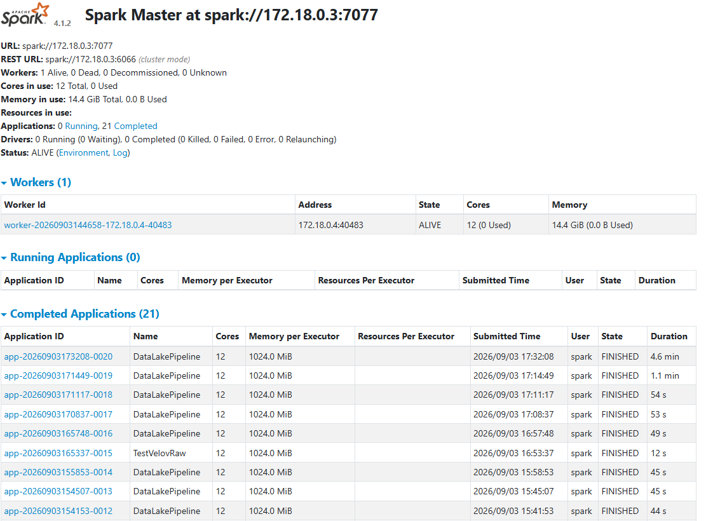

# Data Lake PySpark — Vélo'v & Météo

## Présentation

Ce projet met en place un **Data Lake local conteneurisé** pour collecter et croiser des données de mobilité Vélo'v avec des données météorologiques.

Technologies utilisées :

- **MongoDB** : zone Landing ;
- **MinIO / S3** : zones Raw et Analytics ;
- **Apache Spark** : traitements distribués ;
- **Python** : ingestion des APIs ;
- **Docker Compose** : orchestration des services.

Le pipeline collecte les stations et disponibilités Vélo'v ainsi que la météo, puis Spark nettoie, joint, contrôle et écrit les données finales au format **Parquet partitionné**.

---

## Architecture

```text
             APIs Vélo'v / Open-Meteo
                       │
                       ▼
                  Extraction Python
                       │
             ┌─────────┴─────────┐
             ▼                   ▼
      MongoDB Landing        MinIO Raw
      - disponibilités       - stations
      - météo                - météo CSV
             │                   │
             └─────────┬─────────┘
                       ▼
                 Cluster Spark
              Master + Worker
                       │
          nettoyage / jointures
          qualité / agrégations
                       │
                       ▼
                MinIO Analytics
                 Parquet annee/mois
```

---

## Structure du projet

```text
data-lake-pyspark/
├── .env
├── .gitignore
├── docker-compose.yml
├── pyproject.toml
├── README.md
│
├── extraction/
│   ├── Dockerfile
│   └── requirements.txt
│
├── spark/
│   ├── log4j2.properties
│   ├── jobs/
│   │   └── main.py
│   └── tests/
│       ├── test_mongodb.py
│       └── test_velov_raw.py
│
└── src/
    └── extraction/
        ├── __init__.py
        ├── collect_meteo.py
        ├── collect_velov.py
        ├── load_meteo_minio.py
        ├── load_mongo.py
        ├── load_velov_minio.py
        └── main.py
```

---

## Prérequis

- Docker
- Docker Compose
- Git

Aucune installation locale de Spark, MongoDB ou MinIO n'est nécessaire.

---

## Configuration

Créer un fichier `.env` à la racine avec les variables utilisées par `docker-compose.yml` :

```env
MONGO_INITDB_ROOT_USERNAME=...
MONGO_INITDB_ROOT_PASSWORD=...
MONGO_DATABASE=velov_weather
MONGO_PORT=27017

MINIO_ROOT_USER=...
MINIO_ROOT_PASSWORD=...
MINIO_PORT=9000
MINIO_CONSOLE_PORT=9001

SPARK_MASTER_PORT=7077
SPARK_MASTER_WEBUI_PORT=8080
```

Le fichier `.env` est ignoré par Git.

---

## Démarrage

Construire le service d'extraction :

```powershell
docker compose build extraction
```

Démarrer MongoDB, MinIO et le cluster Spark :

```powershell
docker compose up -d mongodb minio spark-master spark-worker
```

Vérifier les services :

```powershell
docker compose ps
```

Interfaces :

```text
MinIO Console : http://localhost:9001
Spark Master  : http://localhost:8080
```

---

## Extraction et backfill

Exemple de collecte sur 7 jours :

```powershell
docker compose run --rm -e EXTRACTION_START_DATE=2026-08-27 -e EXTRACTION_END_DATE=2026-09-02 extraction
```

Les données sont réparties entre :

```text
MongoDB / velov_weather
├── velov_stations
├── velov_availabilities
└── lyon_meteo

MinIO / raw
├── velov/stations/
└── meteo/
```

Les insertions MongoDB utilisent des **upserts** afin d'éviter les doublons lors d'une nouvelle collecte.

Le backfill final contient :

```text
890 120 disponibilités Vélo'v
```

---

## Traitement PySpark

Le job principal est :

```text
spark/jobs/main.py
```

Il lit :

- le référentiel stations depuis **MinIO Raw** ;
- les disponibilités Vélo'v depuis **MongoDB** ;
- les données météo depuis **MongoDB**.

Il effectue notamment :

- typage et nettoyage ;
- jointure disponibilités / stations ;
- alignement temporel sur 15 minutes ;
- jointure Vélo'v / météo ;
- calcul du taux de disponibilité ;
- contrôles qualité ;
- agrégation station / heure ;
- écriture Parquet partitionnée.

### Exécution

```powershell
docker compose exec spark-master /opt/spark/bin/spark-submit --conf spark.jars.ivy=/tmp/.ivy2 --packages org.apache.hadoop:hadoop-aws:3.4.2,org.mongodb.spark:mongo-spark-connector_2.13:11.1.0 --master spark://spark-master:7077 /opt/spark/jobs/main.py
```

---

## Quality Gate

Avant publication, Spark contrôle notamment :

```text
horodate manquant
station manquante
commune manquante
capacité <= 0
nombre de vélos négatif
météo manquante
taux de disponibilité hors 0–100 %
```

Résultat final :

```text
Lignes MongoDB                  : 890 120
Lignes exploitables             : 888 838
Lignes orphelines               : 1 282
Anomalies capacité / vélos      : 11
Lignes sans météo               : 0
Lignes Analytics finales        : 888 827
Agrégations station / heure     : 56 342
```

Quality Gate final :

```text
horodate_null          = 0
station_null           = 0
commune_null           = 0
capacity_non_positive  = 0
bikes_negatifs         = 0
meteo_null             = 0
taux_hors_limites      = 0
```

---

## Sorties Analytics

Les résultats sont écrits dans MinIO :

```text
analytics/
├── velov_meteo/
└── velov_meteo_station_heure/
```

Les fichiers sont au format **Parquet** et partitionnés par :

```text
annee
mois
```

Exemple :

```text
analytics/velov_meteo/
└── annee=2026/
    ├── mois=8/
    └── mois=9/
```

---

## Tests

Tests techniques disponibles :

```text
spark/tests/
├── test_mongodb.py
└── test_velov_raw.py
```

### MongoDB

```powershell
docker compose exec spark-master /opt/spark/bin/spark-submit --conf spark.jars.ivy=/tmp/.ivy2 --packages org.mongodb.spark:mongo-spark-connector_2.13:11.1.0 --master spark://spark-master:7077 /opt/spark/tests/test_mongodb.py
```

### MinIO Raw

```powershell
docker compose exec spark-master /opt/spark/bin/spark-submit --conf spark.jars.ivy=/tmp/.ivy2 --packages org.apache.hadoop:hadoop-aws:3.4.2 --master spark://spark-master:7077 /opt/spark/tests/test_velov_raw.py
```

---

## Qualité du code

Le projet utilise **Ruff 0.12.12**.

```powershell
docker compose run --rm --no-deps -v "${PWD}:/workspace" -w /workspace extraction python -m ruff check src spark/jobs spark/tests
```

Résultat obtenu :

```text
All checks passed!
```

Validation du fichier Compose :

```powershell
docker compose config --quiet
```

---

## Persistance

MongoDB et MinIO utilisent des volumes Docker :

```text
mongo_data
minio_data
```

Pour arrêter les services sans supprimer les données :

```powershell
docker compose down
```

Ne pas utiliser `docker compose down -v` si les données doivent être conservées.

---

## Captures à intégrer avant le rendu

- MinIO : buckets `raw` et `analytics` ;
- MinIO : partitions Parquet `annee/mois` ;
- Spark UI : Master + Worker ;
- éventuellement la sortie du Quality Gate final.

---

## Captures

### MinIO — Zone Analytics


### MinIO — Partitionnement Parquet


### Spark UI — Master / Worker



### Quality Gate final


## Résultat

Le pipeline complet **API → Landing/Raw → Spark → Analytics** a été validé sur près de **900 000 observations Vélo'v**, avec production de **888 827 lignes Analytics propres** et **56 342 agrégations station / heure**.